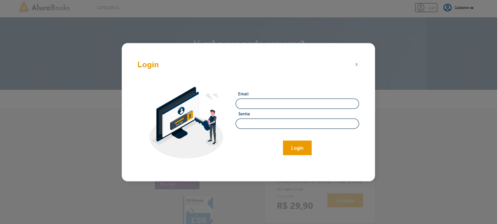

# Projeto AluraBooks

Um grande projeto desenvolvido durante os seguintes cursos com React: Autenticando usuários, Obtendo dados com React Query,
Consumindo GraphQL com Apollo Client e Combinando ContextAPI e Apollo Client

# Principais tecnologias utilizadas no projeto
* React
* NodeJs
* TypeScript
* GraphQL
* Apollo Client
* ContextAPI
* Axios
* Alurabooksbase (Desenvolvido durante outra formação)
* React-Router-DOM

# Imagens do projeto

Pagina inicial do projeto

Pagina contendo o conteúdo de cadastro

Pagina contendo o conteúdo de login

Pagina inicial quando logado

Pagina contendo os pedidos realizados com seus detalhes

Pagina contendo os livros separados por categoria

Pagina contendo os detalhes do livro selecionado
